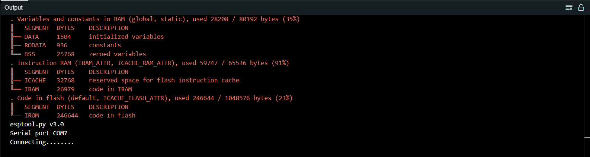
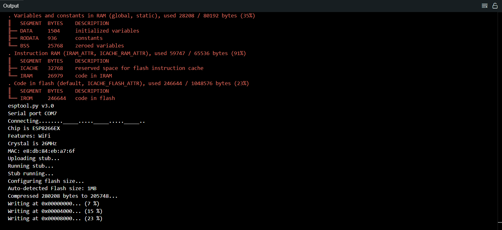

# PSLab ESP01 Firmware
This repository contains firmware for the ESP8266 ESP-01 chip to be used for implementing wireless connectivity with the [Pocket Science Lab (PSLab)](https://pslab.io/) open hardware platform.

## Pocket Science Lab

The PSLab provides an array of test and measurement instruments for doing
science and engineering experiments. Its built-in instruments include an
oscilloscope, a waveform generator, a frequency counter, programmable voltage
and current sources, and a logic analyzer. The PSLab also has UART, I2C, and SPI
buses, via which external devices can be connected and controlled.

The PSLab is a fully open source device, and FOSSASIA provides a complete hardware
and software stack under open source licenses:

- [Hardware](https://github.com/fossasia/pslab-hardware)
- [Bootloader](https://github.com/fossasia/pslab-bootloader)
- [Firmware](https://github.com/fossasia/pslab-firmware)
- [Python library](https://github.com/fossasia/pslab-python)
- [Graphical desktop application](https://github.com/fossasia/pslab-desktop)
- [Android app](https://github.com/fossasia/pslab-android)

### Buy

- You can get a Pocket Science Lab device from the
    [FOSSASIA shop](https://fossasia.com/).

- More resellers are listed on the [PSLab website](https://pslab.io/shop/).

### Get in touch

- The PSLab [chat channel is on Gitter](https://gitter.im/fossasia/pslab).
- Please also join us on the
  [PSLab Mailing List](https://groups.google.com/forum/#!forum/pslab-fossasia).


## Prerequisites
The following tools are required to build and flash the firmware:

### Hardware

- **Arduino UNO** (with USB cable): This will act as a bridge to program the ESP01 chip.
- **Jumper wires**: For connecting the ESP-01 to the Arduino UNO.
- **Resistors** (Optional): Useful for logic level conversion to protect the ESP01 from higher voltage signals.
- **Breadboard** (Optional): For convenient and secure connections.

### Software
- **Arduino IDE**: The development environment for writing and uploading firmware to the ESP01.

## Preparing the IDE

Before flashing the firmware to the ESP-01, you need to set up the Arduino IDE with the required boards and libraries. Follow these steps:

1. Open the Arduino IDE.
2. Navigate to **File > Preferences**.
3. In the "Additional Board Manager URLs" field, add the following URL:
   ```bash
   http://arduino.esp8266.com/stable/package_esp8266com_index.json
   ```
   If there are existing URLs, separate them with a comma.

4. Click **OK** to save the changes.
5. Go to **Tools > Board > Boards Manager**.
6. In the search bar, type **ESP8266**.
7. Select the latest version of the **esp8266 by ESP8266 Community** package and click **Install**.
8. Wait for the installation to complete.

Once these steps are completed, the Arduino IDE is ready to program the ESP-01 chip.

## Preparing the Board

Before proceeding with flashing the firmware, it's important to upload a bare minimum sketch to the Arduino UNO. This ensures the board is in a known state and can act as a bridge for programming the ESP01.

Follow these steps:

1. Connect the Arduino UNO to your computer using the USB cable.
2. Open the Arduino IDE.
3. Go to **File > Examples > 01.Basics > BareMinimum** to load the bare minimum sketch.
4. Select the **Arduino UNO** board from **Tools > Board**.
5. Select the appropriate **COM Port** from **Tools > Port**.
6. Click **Upload** to flash the bare minimum sketch to the Arduino UNO.

This process ensures that the Arduino UNO is ready to act as a programmer for the ESP-01 chip.

## Making the Connections

To program the ESP-01 chip using the Arduino UNO, establish the following connections:

| Arduino UNO | ESP-01          |
|-------------|-----------------|
| RX          | RX              |
| TX          | TX              |
| 3.3 V       | VCC             |
| GND         | GND             |
| RESET       | GND             |
| GND         | GPIO_0          |
| 3.3 V       | CH_PD or CH_EN  |
| GND         | RESET           |

### Additional Notes:

- All Ground pins from UNO and ESP-01 are common.
- 3.3 V connections are common from UNO.
- The RX pin connection between the UNO and the ESP-01 should be made through a voltage divider, since the ESP-01 operates on a 3.3 V logic level and receiving 5 V logic level from the UNO could damage it. A simple 3.3V voltage divider can be made very conveniently using two resistors (10K and 20K).

## Flashing the Firmware

To flash the firmware onto your ESP01 chip using the Arduino IDE, follow these steps:

1. After cloning this repository, open the file containing the firmware (`ESP01Firmware.ino`) in Arduino IDE.

2. Select the **Generic ESP8266 Module** board from **Tools > Board**.
3. Select the appropriate **COM Port** from **Tools > Port**.
4. Click **Upload** and wait for the sketch to compile and uploading to begin.
5. At this point of time, you should be able to see something like this in the output window:

6. In order to allow for the firmware to be uploaded, the RESET pin of the ESP-01 chip should be connected to GND only for a short interval of time. Thus, when you see the above output, wait for a short interval (approx. 1s) and then disconnect the RESET pin from GND.
7. Wait for the program to connect to the chip, until you see something like this:
 This indicates that the firmware flashing has begun.
8. Wait for the flashing to complete until you see something like this:

This indicates that the firmware has been flashed successfully to the ESP-01 chip !

## Preparing the PSLab board
With the firmware successfully flashed onto the ESP-01 chip, the next step is to flash the appropriate firmware onto the PSLab board to enable communication over the UART2 bus.

Use the 'pslab-firmware_v6_esp01.hex' image available from the firmware [release page](https://github.com/fossasia/pslab-firmware/releases/latest).

Follow the steps as indicated in the [firmware repository](https://github.com/fossasia/pslab-firmware?tab=readme-ov-file#flashing) to flash firmware to the PSLab board.

After flashing the firmware to the board, plug in the ESP-01 chip to the header on the board and you are good to go !

> [!NOTE]
> After flashing this firmware to the PSLab, it will no longer communicate over the USB port. To restore the ability to communicate with the PSLab over USB, flash the 'pslab-firmware_v6.hex' image instead (the PSLab always communicates over USB while in bootloader mode, regardless of which application firmware is loaded).

## Building without Arduino IDE

The firmware can be built without installing the Arduino IDE.

### Requirements

- git
- python
- make

### Steps

    # Current working directory is pslab-esp01-firmware
    # Get the ESP8266 toolchain
    git clone https://github.com/esp8266/Arduino esp8266
    cd esp8266
    git submodule update --init
    cd tools
    python get.py
    cd ../..
    export ESP_ROOT=$(readlink -f esp8266)
    # Get makefile
    git clone https://github.com/plerup/makeEspArduino
    # Build
    mkdir build
    make -f makeEspArduino/makeEspArduino.mk SKETCH=src/ESP01Firmware/ESP01Firmware.ino BUILD_DIR=build

ESP01Firmware.bin is now built in the build/ directory.

## Flashing without Arduino

See [docs/esptool.md](https://github.com/fossasia/pslab-esp01-firmware/tree/main/docs/esptool.md).
